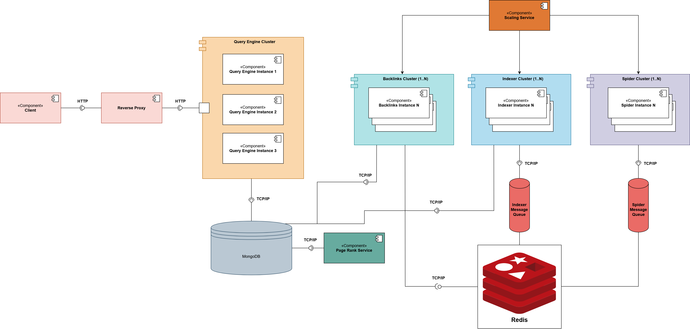

# MOOGLE - The Worst Best Search Engine

```
IMPORTANT NOTE!!!
> After a few weeks of testing moogle, the main server has been shutdown indefinetly.
  This was just a prototype so I had no intentions in keeping it running forever.
  Thanks to all the people who contributed and wanted to contribute. Moogle was
  published two weeks before my thesis deadline so I didn't really have the time or
  energy to look at the requests.
```

Moogle is a search engine designed for educational purposes. Inspired by early 2000s web architecture, Moogle aims to emulate a minimal but functional version of the search engine pipeline: crawling, indexing, and querying the web.

You can find the live version of Moogle at [moogle.app](https://moogle.app).

## Features
- **Page Searching**: Moogle allows users to search for web pages using keywords. The search results are ranked based on the PageRank algorithm and TF-IDF scoring.
- **Image Searching**: Moogle can also search for images.
- **Page Linking**: Moogle provides information about outlinks and backlinks for each page. This is useful for understanding the structure of the web and how pages are connected.
- **Life Ain't Cringe**: A simple extra page that showcases a random page from the web each day and provides search engine data such as the most searched terms that day.

## Architecture
Moogle is built using a microservices architecture, where each component of the search engine is encapsulated in its own service. This allows for easy scaling and maintenance of individual components. All services are located in the `services` directory, and each service has its own Dockerfile for containerization.

Moogle uses Redis as a message broker and to store temporary data, and MongoDB as the primary database for storing indexed data.

### Architecture Diagram
The current diagram is not the updated one, but it gives a good overview of the architecture. The updated diagram will be added later.


### Services
- **Spider**: Responsible for crawling the web and fetching pages. It uses a simple breadth-first search algorithm to discover new links. It stores information in a Redis database for fast access.
- **Indexer**: Takes the crawled pages and indexes them for fast retrieval. It uses a simple inverted index structure to map terms to documents. It processes the information the spider stored in Redis and stores the indexed data in a MongoDB database.
- **Image Indexer**: Indexes images found on the crawled pages. It is essentially a different version of the indexer that focuses on images. It uses a similar inverted index structure to map image URLs to documents.
- **Backlinks Processor**: Transfers backlinks data from Redis to MongoDB. It is a simple service that runs periodically to ensure that the backlinks data is up-to-date.
- **Page Rank**: Calculates the PageRank of each page based on the backlinks data. It uses Google's original PageRank algorithm to determine the importance of each page. It stores the PageRank data in MongoDB.
- **tf-idf**: Calculates the term frequency-inverse document frequency (TF-IDF) for each term in the indexed pages. It uses the TF-IDF algorithm to determine the importance of each term in the context of the entire collection of documents. It stores the TF-IDF data in MongoDB.
- **Query Engine**: Essentially the backend of the search engine. It takes user queries and retrieves the relevant documents from the indexed data. It uses a simple keyword matching algorithm to find the most relevant documents. It also uses the PageRank and TF-IDF data to rank the results.
- **Monitoring**: A simple service that monitors and spawns new instances of other services as needed. Currently it is not updated to work with the new architecture, but it is a placeholder for future development.
- **Client**: A simple web client that allows users to interact with the search engine. It provides a 2000s-inspired interface for searching the web. It uses a simple HTML/CSS/JS stack and communicates with the backend services using REST APIs.

## Repo Structure

```bash
.
├── migration/
├── services/
│   ├── spider/
│   ├── indexer/
│   ├── search-engine/
│   ├── client/
│   └── ...
└── README.md
```

## Workflow

1. Spiders crawl and pushes raw content into a Redis queue.
2. Indexer and Image indexer process the content, updating the search index.
3. Backlinks processor updates the backlinks data in MongoDB.
4. TF-IDF calculates the term frequency-inverse document frequency for each term in the indexed pages.
5. Page Rank calculates the PageRank of each page based on the backlinks data.
6. Query Engine handles incoming queries and returns ranked results.
7. Client (frontend) lets users enter queries and view results.

## Tech Stack
- **Redis** for a fast in-memory data store and message broker.
- **MongoDB** for a scalable NoSQL database to store indexed data.
- **Docker** for containerization of services.
- **Go** for a high performance spider and page rank calculation.
- **Python** for the indexer, image indexer, backlinks processor, and tf-idf calculation.
- **PHP** with **Laravel** for the query engine.
- **HTML/CSS/JS** for the client-side web interface.

## Setup
- Clone the repository by running `git clone https://github.com/IonelPopJara/moogle`.
- Install Docker and Docker Compose on your machine.
- Read each service's README file for specific setup instructions.
- Follow the instructions in the README files to set up each service.

## Notes
The documentation is a work in progress. I'll update it once I finish writing my thesis. For now, please refer to the code and comments in each service for more information on how to use them.
